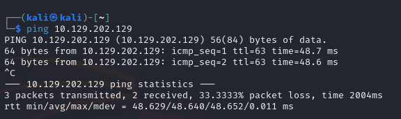
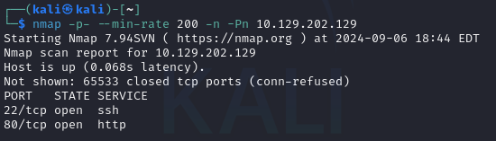
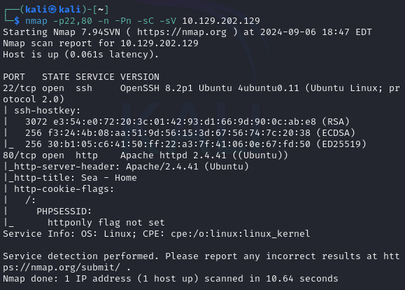

# Sea

## Enumeration

First we ping the machine to see if it is active and we can reach it.

<figure><figcaption></figcaption></figure>

We see that we get response with a ttl=63. As the number is near 64 we can say in a first approach that we have a linux machine.

Now we enumerate the machine with nmap.&#x20;

<figure><figcaption></figcaption></figure>

On a first approach  we can see we have 2 open ports, let's make a deeper scan:

<figure><figcaption></figcaption></figure>

Looking for port 80 we encounter a website.

<figure><figcaption></figcaption></figure>
